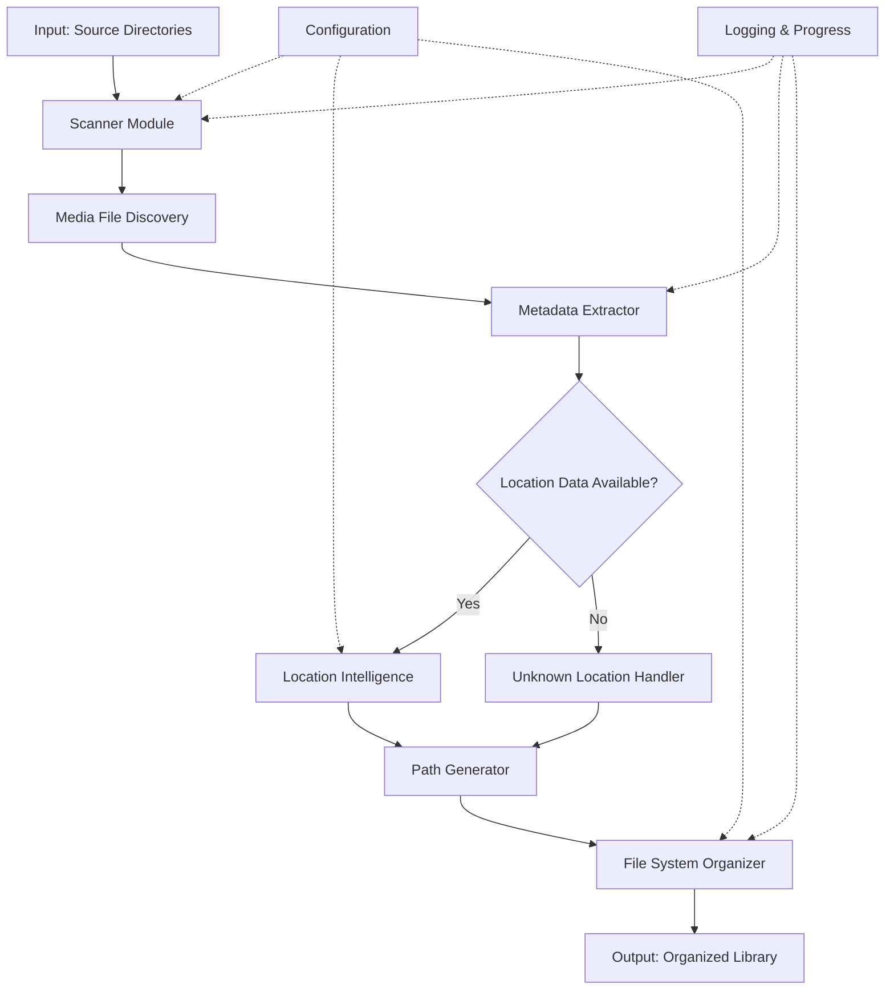
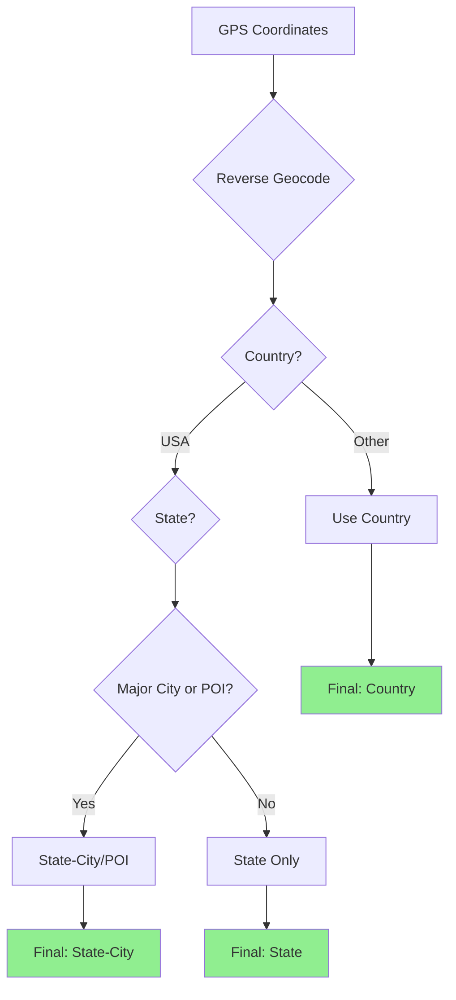
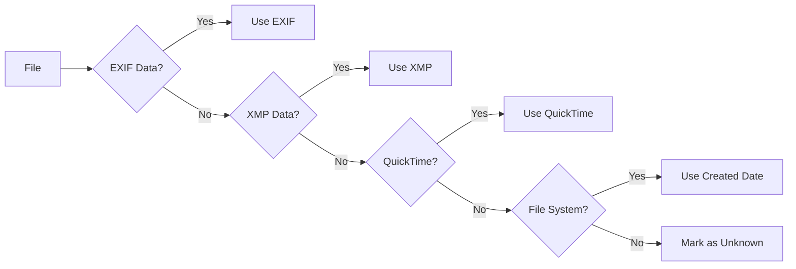
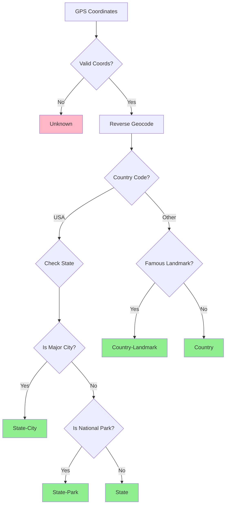
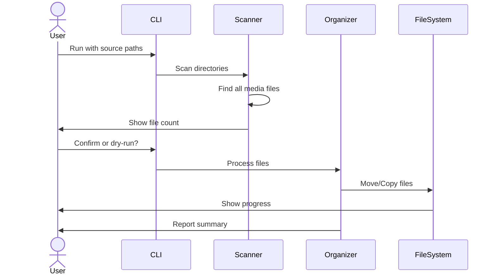
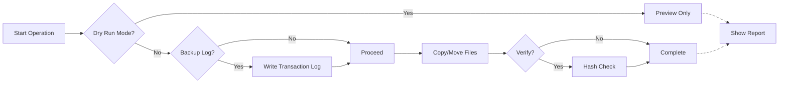

# Photo/Video Organizer - Product Specifications

**Version:** 1.0  
**Date:** November 12, 2025  
**Target Platform:** macOS

---

## 1. Vision & End Goal

**End State:** A clean, intelligently organized photo/video library where every file is automatically sorted by time and location, making it trivial to find "all photos from Norway in June 2023" or "California trips in 2024."

**Success Criteria:**

- 100% of photos/videos automatically organized by YYYY/MM/Location
- Zero manual file moving required
- Preserve all original metadata and filenames
- Fast processing (1000+ files in reasonable time)
- Safe operation (no data loss, with dry-run option)

---

## 2. System Architecture



---

## 3. Core Components

### 3.1 High-Level Data Flow


### 3.2 Component Breakdown

| Component | Responsibility | Key Technologies |
|-----------|---------------|------------------|
| **Scanner** | Find all media files recursively | os.walk(), pathlib |
| **Metadata Extractor** | Read EXIF, XMP, QuickTime data | exiftool, PIL/Pillow, mutagen |
| **Location Intelligence** | Determine appropriate location granularity | geopy, custom rules engine |
| **Path Generator** | Create normalized directory structure | string formatting, sanitization |
| **File Organizer** | Safely move/copy files | shutil, atomic operations |
| **Configuration Manager** | Handle user preferences | YAML/JSON config |
| **Progress Tracker** | Real-time feedback | tqdm, logging |

---

## 4. Target Directory Structure

### 4.1 Desired Output Format

```bash
Photos/
├── 2023/
│   ├── 06/
│   │   ├── Norway/
│   │   │   ├── 2023-06-15_IMG_1234.jpg
│   │   │   ├── 2023-06-16_IMG_1235.jpg
│   │   │   └── 2023-06-17_VID_5678.mp4
│   │   └── Sweden/
│   │       └── 2023-06-20_IMG_1240.jpg
│   └── 12/
│       └── California-Yosemite/
│           ├── 2023-12-10_DSC_9876.jpg
│           └── 2023-12-11_DSC_9877.jpg
├── 2024/
│   └── 03/
│       ├── Washington-Seattle/
│       │   └── 2024-03-15_IMG_2000.jpg
│       └── Unknown/
│           └── 2024-03-20_IMG_2005.jpg
└── Unknown_Date/
    └── Unknown/
        └── Unknown_IMG_0001.jpg
```

### 4.2 Naming Convention Rules

| Element | Format | Example | Notes |
|---------|--------|---------|-------|
| **Year** | YYYY | 2023 | From EXIF DateTimeOriginal |
| **Month** | MM | 06 | Zero-padded |
| **Location** | See §4.3 | Norway, California-Yosemite | Context-dependent granularity |
| **Filename** | YYYY-MM-DD_original | 2023-06-15_IMG_1234.jpg | Preserves original name |

### 4.3 Location Granularity Logic



**Granularity Rules:**

| Location Type | Format | Examples |
|--------------|---------|----------|
| **Foreign Country** | Country | Norway, Japan, France, Australia |
| **US State (rural)** | State | Montana, Wyoming, Vermont |
| **US Major City** | State-City | California-San_Francisco, New_York-NYC |
| **US National Park** | State-Park | California-Yosemite, Utah-Zion |
| **US Landmark** | State-Landmark | Arizona-Grand_Canyon |
| **Multiple Locations** | Primary Location | (most photos in folder) |
| **No GPS Data** | Unknown | Unknown |

**Concrete Examples:**

- Oslo, Norway → `Norway/`
- Rural Montana → `Montana/`
- San Francisco, CA → `California-San_Francisco/`
- Yosemite NP → `California-Yosemite/`
- Tokyo, Japan → `Japan/`
- Multiple cities in one day → Use most frequent location

---

## 5. Metadata Extraction Strategy

### 5.1 Priority Order

For each file, attempt to extract metadata in this order:



### 5.2 Metadata Fields

| Field | EXIF Tag | QuickTime Tag | Fallback |
|-------|----------|---------------|----------|
| **Date Taken** | DateTimeOriginal, CreateDate | CreationDate | File system creation date |
| **GPS Latitude** | GPSLatitude | GPSLatitude | None |
| **GPS Longitude** | GPSLongitude | GPSLongitude | None |
| **Camera Make** | Make | — | None |
| **Camera Model** | Model | — | None |

### 5.3 Supported File Types

**Images:**

- JPEG (.jpg, .jpeg)
- PNG (.png)
- HEIC (.heic)
- RAW formats (.cr2, .nef, .arw, .dng)

**Videos:**

- MP4 (.mp4)
- MOV (.mov)
- AVI (.avi)
- MKV (.mkv)

---

## 6. Location Intelligence Rules

### 6.1 Decision Tree



### 6.2 Major Cities Definition

Cities with metro population > 2 million OR tourist significance:

**US Major Cities:**

- New York, Los Angeles, Chicago, Houston, Phoenix
- Philadelphia, San Antonio, San Diego, Dallas, San Francisco
- Seattle, Boston, Miami, Atlanta, Denver, Las Vegas

**National Parks (Top 20):**

- Yosemite, Yellowstone, Grand Canyon, Zion, Rocky Mountain
- Acadia, Grand Teton, Olympic, Glacier, Bryce Canyon
- (Full list in config file)

### 6.3 Free Geocoding Services Comparison

| Service | Free Tier Limit | Rate Limit | Accuracy | Notes |
|---------|----------------|------------|----------|-------|
| **Nominatim** | Unlimited | 1 req/sec | Good | OpenStreetMap data, requires User-Agent |
| **LocationIQ** | 5,000/day | 2 req/sec | Very Good | Fast, reliable, email signup |
| **Geoapify** | 3,000/day | 5 req/sec | Excellent | Modern API, good documentation |
| **OpenCage** | 2,500/day | 1 req/sec | Very Good | Multiple data sources |

**Implementation Strategy:**

1. Start with **LocationIQ** (highest free tier)
2. Fallback to **Nominatim** if daily limit reached
3. Cache all geocoding results in local SQLite DB
4. For 1000+ photos with unique locations, likely need ~100-200 API calls
5. With caching, repeated runs cost 0 API calls

### 6.4 Location Clustering (25-Mile Threshold)

Photos taken within 25 miles of each other are grouped into the same location folder.

**Algorithm:**

1. Extract GPS coordinates from all photos in same month
2. Cluster photos using distance threshold: 25 miles (40.2 km)
3. For each cluster, determine the representative location name:
   - If 80%+ photos in major city → use city name
   - If in national park → use park name
   - Otherwise → use most granular common location (state)

**Example Scenarios:**

| Photo Locations | Distance | Folder Name | Logic |
|----------------|----------|-------------|-------|
| SF (37.77°N, 122.41°W) + Oakland (37.80°N, 122.27°W) | ~10 miles | `California-San_Francisco/` | Within 25mi, use primary city |
| Yosemite Valley + Glacier Point | ~15 miles | `California-Yosemite/` | Same national park |
| LA (34.05°N) + San Diego (32.71°N) | ~120 miles | Split: `California-Los_Angeles/` + `California-San_Diego/` | Exceeds 25mi threshold |
| Rural Montana spots 20mi apart | ~20 miles | `Montana/` | Within threshold, no major city |

**Distance Calculation:**

```python
from math import radians, sin, cos, sqrt, atan2

def haversine_distance(lat1, lon1, lat2, lon2):
    """Calculate distance in miles between two GPS coordinates"""
    R = 3959  # Earth's radius in miles
    
    lat1, lon1, lat2, lon2 = map(radians, [lat1, lon1, lat2, lon2])
    dlat = lat2 - lat1
    dlon = lon2 - lon1
    
    a = sin(dlat/2)**2 + cos(lat1) * cos(lat2) * sin(dlon/2)**2
    c = 2 * atan2(sqrt(a), sqrt(1-a))
    
    return R * c
```

---

## 7. User Interface & Workflow

### 7.1 Basic Usage Flow



### 7.2 Command-Line Interface

**Basic Command:**

```bash
python photo_organizer.py \
  --source ~/Pictures/Unsorted \
  --destination ~/Pictures/Organized \
  --dry-run
```

**With copy mode (safer):**

```bash
python photo_organizer.py \
  --source ~/Pictures/Unsorted \
  --destination ~/Pictures/Organized \
  --mode copy
```

**Parameters:**

| Parameter | Required | Description | Default |
|-----------|----------|-------------|---------|
| `--source` | Yes | Source directory(ies) to scan | — |
| `--destination` | Yes | Root of organized library | — |
| `--mode` | No | `copy` or `move` | `move` |
| `--dry-run` | No | Preview without changes | False |
| `--recursive` | No | Scan subdirectories | True |
| `--exclude` | No | Exclude directory
 | - |
| `--config` | No | Path to config file | `config.yaml` |
| `--threads` | No | Parallel processing threads | 4 |
| `--log-level` | No | Logging verbosity | INFO |

---

## 8. Configuration File

### 8.1 Sample config.yaml

```yaml
# Location Intelligence Settings
location_rules:
  major_cities:
    - "New York"
    - "Los Angeles"
    - "San Francisco"
    - "Seattle"
    # ... more cities
  
  national_parks:
    - "Yosemite"
    - "Yellowstone"
    - "Grand Canyon"
    # ... more parks
  
  granularity:
    foreign_countries: "country"  # Just country name
    us_rural: "state"             # State only
    us_cities: "state-city"       # State-City
    us_parks: "state-park"        # State-Park

# File Processing
processing:
  supported_extensions:
    images: [".jpg", ".jpeg", ".png", ".heic", ".cr2", ".nef"]
    videos: [".mp4", ".mov", ".avi", ".mkv"]
  
  skip_hidden_files: true
  preserve_original_filename: true
  add_date_prefix: true

# Safety & Performance
safety:
  require_confirmation: true
  create_backup_log: true
  verify_after_move: true

performance:
  max_threads: 4
  batch_size: 100
  cache_geocoding: true
```

---

## 9. Error Handling & Edge Cases

### 9.1 Common Scenarios

| Scenario | Handling Strategy |
|----------|------------------|
| **No GPS data** | Place in `Unknown/` folder |
| **No date metadata** | Place in `Unknown_Date/Unknown/` |
| **Invalid GPS coordinates** | Place in `Unknown/` |
| **Duplicate filenames** | Append counter: `_1`, `_2`, etc. |
| **Corrupted files** | Log error, skip file, continue |
| **Insufficient permissions** | Log error, report at end |
| **Disk space full** | Stop immediately, rollback if possible |
| **Network failure (geocoding)** | Cache failed coords, retry later |

### 9.2 Data Safety



---

## 10. Technical Implementation Plan (1 Week)

### 10.1 Day 1-2: Core Scanner & Metadata

- [ ] Build file discovery engine
- [ ] Implement metadata extraction (EXIF + QuickTime for videos)
- [ ] Create folder structure generator
- [ ] Test with 10-100 files

### 10.2 Day 3-4: Location Intelligence

- [ ] Integrate geocoding API (geopy/Nominatim)
- [ ] Implement location granularity rules with caching
- [ ] Add parallel processing for performance
- [ ] Test with 100-1000 files

### 10.3 Day 5-6: Production Features & Safety

- [ ] Implement dry-run, logging, and progress bars
- [ ] Add error handling for all edge cases
- [ ] Implement file verification (hash checks)
- [ ] Handle duplicates and unknown data

### 10.4 Day 7: Testing & Polish

- [ ] Performance optimization
- [ ] Test with full library (1000s of files)
- [ ] Create usage documentation and examples
- [ ] Final bug fixes

---

## 11. Performance Estimates

### 11.1 Expected Throughput

| Library Size | Estimated Time | Notes |
|--------------|----------------|-------|
| 100 files | 30-60 seconds | Includes geocoding |
| 1,000 files | 5-10 minutes | With caching |
| 10,000 files | 30-60 minutes | Parallel processing |
| 50,000 files | 3-5 hours | Large library |

**Bottlenecks:**

- Geocoding API calls (can be cached)
- File I/O operations (especially on network drives)
- Metadata extraction for RAW files

---

## 12. Dependencies & Technology Stack

### 12.1 Core Libraries (Python)

```python
# Metadata Extraction
from PIL import Image
from PIL.ExifTags import TAGS, GPSTAGS
import exiftool  # Or: PyExifTool wrapper

# Geocoding
from geopy.geocoders import Nominatim
import requests  # For API fallback

# File Operations
import shutil
from pathlib import Path
import hashlib  # For verification

# Progress & Logging
from tqdm import tqdm
import logging

# Configuration
import yaml
import argparse

# Parallelization (optional)
from concurrent.futures import ThreadPoolExecutor
```

### 12.2 System Requirements

- macOS 10.14+
- Python 3.13+ (fallback to 3.12 if dependencies require)
- Internet connection (for geocoding)
- Read/write permissions for source and destination

---

## 13. Open Questions & Decisions Needed

### 13.1 Critical Decisions ✅ FINALIZED

1. **Operation Mode Default:** ✅ **MOVE**
   - Files will be moved (not copied) by default
   - Safer copy mode available via `--mode copy` flag

2. **Geocoding Service:** ✅ **FREE (Multiple Options)**
   - Primary: Nominatim (OpenStreetMap)
   - Alternatives to explore:
     - **LocationIQ** (free tier: 5,000 requests/day)
     - **Geoapify** (free tier: 3,000 requests/day)
     - **OpenCage** (free tier: 2,500 requests/day)
   - Implementation will cache all results to minimize API calls
   - Fallback to alternative service if primary fails

3. **Duplicate Handling:** ✅ **RENAME WITH COUNTER**
   - If `2023-06-15_IMG_1234.jpg` exists, rename to `2023-06-15_IMG_1234_1.jpg`
   - Continue with `_2`, `_3`, etc. for multiple duplicates
   - **Track and report total duplicates** in summary stats
   - Create `duplicates_report.txt` listing all duplicates for manual review

4. **Location Precision Threshold:** ✅ **25 MILES**
   - Photos taken within 25 miles of each other → same location folder
   - Photos from "San Francisco" and "Oakland" (10 mi apart) → both in `California-San_Francisco/`
   - Use centroid or most frequent location as folder name

5. **Multi-Location Trips:** ✅ **SPLIT BY PRIMARY LOCATION**
   - Road trip: 50 photos in Colorado, 30 in Utah, 20 in Arizona
   - Result: 50 in `Colorado/`, 30 in `Utah/`, 20 in `Arizona/`
   - Each photo goes to its own location (not grouped by primary)

### 13.2 Nice-to-Have Features (Future)

- [ ] GUI interface
- [ ] Undo/rollback functionality
- [ ] Duplicate photo detection (by hash)
- [ ] Automatic album creation in Photos.app
- [ ] Cloud storage integration (Google Photos, iCloud)
- [ ] Face recognition for additional organization
- [ ] Export organized metadata to spreadsheet

---

## 14. Success Metrics

- **Accuracy:** >95% of files correctly dated
- **Location:** >90% with valid location info
- **Performance:** <5 min per 1000 files
- **Safety:** 0% data loss
- **Usability:** <5 min to learn and run

---

## 15. Next Steps

1. **Answer Open Questions** (§13.1)
2. **Review and Approve Specs**
3. **Set Up Development Environment**
4. **Build Phase 1 Prototype**
5. **Test on Small Sample** (10-100 files)
6. **Iterate Based on Results**

---

## Appendix A: Example Runs

### A.1 Dry Run Output

```python
$ python photo_organizer.py --source ~/Old_Photos --destination ~/Organized --dry-run

🔍 Scanning directories...
Found 1,247 media files (982 images, 265 videos)

📊 Preview of organization plan:

2023/
├── 06/
│   └── Norway/ (45 files)
├── 08/
│   └── California-Yosemite/ (23 files)
└── 12/
    └── Unknown/ (12 files)

2024/
├── 03/
│   └── Washington-Seattle/ (67 files)
└── 07/
    └── Montana/ (134 files)

Unknown_Date/
└── Unknown/ (8 files)

⚠️  Files without GPS data: 178 (14.3%)
⚠️  Files without date: 8 (0.6%)

✅ Dry run complete. No files were moved.
   Run without --dry-run to execute.
```

### A.2 Actual Run Output with Statistics

```python
$ python photo_organizer.py --source ~/Old_Photos --destination ~/Organized

🔍 Scanning directories...
Found 1,247 media files (982 images, 265 videos)

📊 Organization Plan Summary:
   - 1,169 files with GPS data (93.7%)
   - 78 files without GPS data (6.3%)
   - 1,239 files with valid dates (99.4%)
   - 8 files without dates (0.6%)

⚠️  WARNING: This will MOVE files (originals will be removed from source)
Continue? [y/N]: y

🚀 Processing files...
[████████████████████████████████████████] 1247/1247 (100%)

✅ Organization Complete!

═══════════════════════════════════════════════════════════
                    EXECUTION SUMMARY
═══════════════════════════════════════════════════════════

📁 Total Files Processed:     1,247
   ├─ Images:                   982
   └─ Videos:                   265

📊 Organization Results:
   ├─ Successfully moved:      1,247 (100%)
   ├─ Failed:                      0 (0%)
   └─ Skipped:                     0 (0%)

📍 Location Statistics:
   ├─ With GPS data:           1,169 (93.7%)
   ├─ Without GPS (Unknown):      78 (6.3%)
   └─ Unique locations:           23

📅 Date Statistics:
   ├─ With EXIF date:          1,239 (99.4%)
   └─ Without date:                8 (0.6%)

🔄 Duplicate Handling:
   ├─ Total duplicates found:     34 (2.7%)
   ├─ Renamed with counter:       34
   └─ Report saved: duplicates_report.txt

🗂️  Directory Structure:
   ├─ Years created:                3 (2022, 2023, 2024)
   ├─ Months populated:            18
   ├─ Location folders:            23
   └─ Unknown folders:              1

⏱️  Performance:
   ├─ Total time:              4m 23s
   ├─ Average per file:        211ms
   ├─ Geocoding API calls:        156 (cached: 1,013)
   └─ Files/second:              4.7

📝 Logs saved to:
   - Main log: photo_organizer_20241112_143022.log
   - Duplicates: duplicates_report.txt
   - Transaction: transaction_log.json

═══════════════════════════════════════════════════════════
```

### A.3 Detailed Duplicate Report (duplicates_report.txt)

```bash
Photo/Video Organization - Duplicate Files Report
Generated: 2024-11-12 14:30:22
═══════════════════════════════════════════════════════════

Total Duplicates Found: 34

DUPLICATE #1:
  Original:  2023/06/Norway/2023-06-15_IMG_1234.jpg
  Duplicate: 2023/06/Norway/2023-06-15_IMG_1234_1.jpg
  File Size: 4.2 MB
  Date Taken: 2023-06-15 10:23:45

DUPLICATE #2:
  Original:  2023/08/California-Yosemite/2023-08-20_DSC_5678.jpg
  Duplicate: 2023/08/California-Yosemite/2023-08-20_DSC_5678_1.jpg
  File Size: 6.8 MB
  Date Taken: 2023-08-20 14:15:32

[... continues for all 34 duplicates ...]

═══════════════════════════════════════════════════════════
RECOMMENDATIONS:
1. Review each duplicate to determine if they are truly identical
2. Use hash comparison to identify exact duplicates:
   python photo_organizer.py --find-exact-duplicates ~/Organized
3. Consider using Photos.app "Find Duplicates" feature
4. Manual review recommended before deletion
═══════════════════════════════════════════════════════════
```

### A.4 Transaction Log (transaction_log.json)

A JSON file is created for audit trail and potential rollback:

```json
{
  "timestamp": "2024-11-12T14:30:22",
  "operation": "move",
  "source_directories": ["/Users/user/Old_Photos"],
  "destination": "/Users/user/Organized",
  "summary": {
    "total_files": 1247,
    "successful": 1247,
    "failed": 0,
    "duplicates": 34
  },
  "files": [
    {
      "original_path": "/Users/user/Old_Photos/IMG_1234.jpg",
      "new_path": "/Users/user/Organized/2023/06/Norway/2023-06-15_IMG_1234.jpg",
      "timestamp": "2024-11-12T14:30:25",
      "metadata": {
        "date_taken": "2023-06-15T10:23:45",
        "gps": [59.9139, 10.7522],
        "location": "Norway"
      }
    }
    // ... more file entries
  ]
}
```

---

End of Specifications Document
